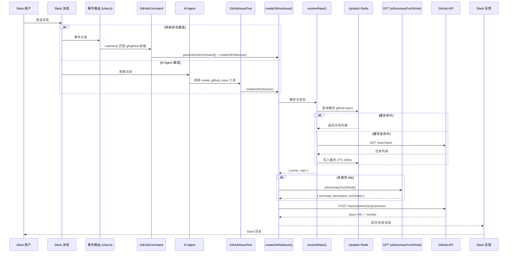

# GitHub Issue 创建功能文档

## 1. 功能概述

GitHub Issue 创建模块为 Gengar Bark 提供了从 Slack 对话中快速创建 GitHub Issue 的能力。该功能支持两条触发路径：

- **传统命令**：用户在 Slack 中通过 `gh` 或 `github` 前缀命令直接创建 issue，由 `GitHubCommand` 处理。
- **AI Agent**：AI 对话中自动识别用户创建 issue 的意图，通过 `create_github_issue` 工具调用完成创建。

两条路径最终都调用核心函数 `createGitHubIssue()`，共享相同的仓库解析、AI 摘要、Jira 关联和错误处理逻辑。

---

## 2. 数据流



---

## 3. 命令格式与使用示例

### 3.1 基本格式

```
gh <repo> [label] [title] [JIRA-TICKET ...]
github <repo> [label] [title] [JIRA-TICKET ...]
```

- `repo`（必填）：仓库名称，支持精确匹配和模糊匹配。
- `label`（选填）：issue 标签，仅含 ASCII 字母、数字和连字符的单词会被识别为 label。
- `title`（选填）：issue 标题，未提供时 AI 从 Slack 线程上下文自动生成。
- `JIRA-TICKET`（选填）：Jira ticket 号，格式为 `大写字母-数字`（如 `MER-123`），可出现在命令任意位置。

### 3.2 使用示例

| 命令 | 说明 |
|---|---|
| `gh gengar-bark` | 仅指定仓库，title 和 description 由 AI 自动生成 |
| `gh gengar-bark bug` | 指定仓库和 label |
| `gh gengar-bark bug 修复登录页面崩溃` | 指定仓库、label 和 title |
| `gh gengar-bark 修复登录页面崩溃` | 指定仓库和 title（非 ASCII 开头，不会被误判为 label） |
| `gh gengar-bark bug 修复登录 MER-123` | 指定仓库、label、title 并关联 Jira ticket |
| `gh gengar-bark bug MER-123 CRM-456` | 指定仓库、label 并关联多个 Jira ticket，title 由 AI 生成 |
| `github moego-web feat 新增用户管理功能` | 使用 `github` 前缀 |

### 3.3 AI Agent 调用示例

用户在对话中自然表达意图，Agent 自动识别并调用工具：

> "帮我在 gengar-bark 仓库创建一个 bug issue，标题是登录超时"

Agent 将调用 `create_github_issue` 工具，参数：

```json
{
  "repo": "gengar-bark",
  "label": "bug",
  "title": "登录超时"
}
```

---

## 4. 模块架构

### 4.1 源文件与职责

| 文件路径 | 职责 |
|---|---|
| `lib/github/create-issue.ts` | 核心模块：命令解析、仓库解析、AI 摘要、模板匹配、issue 创建 |
| `lib/commands/gengar-commands.ts` | `GitHubCommand` 类：传统命令匹配与执行 |
| `lib/agent/tools/github-issue-tool.ts` | `GitHubIssueTool` 类：AI Agent 工具封装 |
| `lib/events-handlers/chat.ts` | 事件路由：注册 `GitHubCommand`（位于 `JiraCommand` 之后、`CiCommand` 之前） |
| `lib/agent/tools/index.ts` | 工具注册：`createGitHubIssueTool()` 在 `createAllTools()` 中注册 |

### 4.2 核心函数

| 函数 | 说明 |
|---|---|
| `parseGitHubCommand(text)` | 解析命令文本，提取 repo、label、title、jiraTickets |
| `resolveRepo(repoName)` | 通过 GitHub API 解析仓库名为 `owner/repo`，带 Redis 缓存 |
| `aiSummaryForGitHub(channel, ts)` | 从 Slack 线程生成 AI 摘要（title + description + jiraTickets） |
| `fetchIssueTemplates(owner, repo)` | 获取仓库的 issue 模板列表，带 Redis 缓存，失败静默降级 |
| `selectTemplateWithAI(templates, context)` | 使用 AI 根据 label/title/description 智能选择最匹配的模板 |
| `buildBodyFromTemplate(templateBody, ctx)` | 基于模板 body 构建 issue body，底部追加补充上下文 |
| `buildDefaultBody(ctx)` | 无模板时的回退格式（与原有固定格式一致） |
| `createGitHubIssue(params)` | 核心创建函数，整合上述所有逻辑，返回结果不抛异常 |
| `isLabelToken(token)` | 判断 token 是否为 label（正则：`/^[a-zA-Z0-9\-]+$/`） |

### 4.3 命令注册顺序（chat.ts）

```
HelpCommand → IdCommand → JiraCommand → GitHubCommand → CiCommand → CreateAppointmentCommand → FileCommand → AgentCommand
```

命令按顺序匹配，第一个 `matches()` 返回 `true` 的命令执行。

---

## 5. 配置要求

### 5.1 环境变量

| 变量名 | 必填 | 说明 |
|---|---|---|
| `GITHUB_PAT` | ✅ | GitHub Personal Access Token，需具备 `repo` 权限 |

Token 用于：
- `GET /user/repos`：获取可访问仓库列表
- `POST /repos/{owner}/{repo}/issues`：创建 issue

请求头格式：`Authorization: Bearer {GITHUB_PAT}`

### 5.2 Redis 缓存依赖

| 配置项 | 值 |
|---|---|
| 缓存 Key（仓库列表） | `github:repos` |
| 缓存 Key（模板列表） | `github:templates:{owner}/{repo}` |
| TTL | 600 秒（10 分钟） |
| 存储内容 | 仓库列表 JSON / 模板列表 JSON |
| 失败策略 | 静默降级，直接调用 GitHub API |

依赖 Upstash Redis（通过 `lib/upstash/upstash.ts` 的 `getCache` / `setCacheEx`）。

---

## 6. Label 体系

### 6.1 推荐 Label 列表

采用 Angular commit 风格的标签命名：

| Label | 用途 |
|---|---|
| `bug` | 缺陷修复 |
| `feat` | 新功能 |
| `fix` | 问题修复 |
| `ci` | CI/CD 相关 |
| `perf` | 性能优化 |
| `docs` | 文档更新 |
| `style` | 代码风格 |
| `refactor` | 代码重构 |
| `test` | 测试相关 |
| `chore` | 杂项任务 |

### 6.2 自定义 Label

Label 不限于推荐列表。任何符合 `isLabelToken()` 规则的单词（仅含 ASCII 字母、数字、连字符）都会被识别为 label。例如：

- `hotfix` ✅ 识别为 label
- `urgent-fix` ✅ 识别为 label
- `修复问题` ❌ 含中文，识别为 title 的开始
- `fix login` ❌ 含空格，`fix` 识别为 label，`login` 归入 title

### 6.3 Label 传递

- 传统命令：解析后作为 `label` 参数传入 `createGitHubIssue()`
- AI Agent：通过工具参数 `label` 字段传入
- GitHub API：以 `labels: [label]` 数组形式附加到 issue

---

## 7. Jira Ticket 关联

### 7.1 识别方式

Jira ticket 通过两种方式识别：

1. **命令中显式指定**：`parseGitHubCommand()` 使用正则 `/[A-Z]+-\d+/g` 从整个命令文本中提取。
2. **AI 自动识别**：`aiSummaryForGitHub()` 从 Slack 线程内容中由 GPT 提取。

### 7.2 合并与去重

当同时存在显式指定和 AI 识别的 ticket 时，使用 `Set` 进行去重合并：

```typescript
jiraTickets = Array.from(new Set(jiraTickets.concat(aiTickets)));
```

### 7.3 Title 追加

如果存在 Jira ticket 且 title 非空，ticket 号会追加到 title 末尾：

```
原始 title: 修复登录问题
最终 title: 修复登录问题 MER-123 CRM-456
```

### 7.4 Issue Body 中的关联

当存在 Jira ticket 时，issue body 中会生成 "Related Jira Tickets" 章节：

```markdown
## Related Jira Tickets
- [MER-123](https://moego.atlassian.net/browse/MER-123)
- [CRM-456](https://moego.atlassian.net/browse/CRM-456)
```

### 7.5 Issue Body 完整结构

```
Reporter: {userName}
Slack Thread: https://moegoworkspace.slack.com/archives/{channelId}/p{threadTs}

{description}

## Related Jira Tickets
- [TICKET-ID](https://moego.atlassian.net/browse/TICKET-ID)
```

其中 Slack Thread 链接的 `threadTs` 会移除小数点（如 `1234567890.123456` → `1234567890123456`）。

---

## 8. Issue 模板支持

### 8.1 工作原理

创建 issue 时，系统会自动尝试获取目标仓库的 issue 模板（`.github/ISSUE_TEMPLATE/*.md`），并通过 AI 智能选择最匹配的模板来构建 issue body，而非使用固定格式。

流程：
1. `fetchIssueTemplates()` 通过 GitHub Contents API 获取仓库模板列表，解析 YAML front matter 和 markdown body
2. `selectTemplateWithAI()` 将所有模板的 name、about、labels 信息连同当前 issue 的 label、title、description 一起发送给 GPT，由 AI 综合判断选择最佳模板（非简单的 label 等值匹配）
3. 匹配到模板时，使用 `buildBodyFromTemplate()` 以模板 body 为主体，在底部追加补充上下文（Reporter、Slack Thread、description、Jira Tickets）
4. 无模板或匹配失败时，回退到 `buildDefaultBody()` 使用原有固定格式

### 8.2 模板解析

模板文件格式（标准 GitHub issue template）：

```yaml
---
name: Bug Report
about: Create a report to help us improve
labels: [bug, needs-triage]
title: ''
---
## Describe the bug
A clear and concise description.

## Steps to Reproduce
1.
2.
3.
```

解析规则：
- YAML front matter 中提取 `name`、`about`、`labels`、`title`
- `labels` 支持单值（`labels: bug`）和数组格式（`labels: [bug, needs-triage]`）
- front matter 之后的 markdown 内容作为模板 body

### 8.3 智能匹配

AI 匹配基于以下上下文综合判断：
- 用户指定的 label（如有）
- issue 的 title 和 description
- 每个模板的 name、about 描述和关联 labels

这意味着即使 label 不完全一致（如用户给 `bug` 但模板 labels 是 `[bug, needs-triage]`），AI 也能正确匹配。甚至没有 label 时，AI 也能根据 title/description 内容选择合适的模板。

超时保护：4 秒超时，超时或异常时返回 null，回退到默认格式。

### 8.4 模板 Body 结构

使用模板时，issue body 结构为：

```markdown
{模板原始 markdown body}

---

### Additional Context
- **Reporter**: {userName}
- **Slack Thread**: {threadLink}

{description}

### Related Jira Tickets
- [MER-123](https://moego.atlassian.net/browse/MER-123)
```

模板中未涵盖的信息（Reporter、Slack Thread、description、Jira Tickets）统一在底部作为补充上下文追加。

### 8.5 缓存

模板列表按仓库缓存到 Redis：
- Key: `github:templates:{owner}/{repo}`
- TTL: 600 秒（10 分钟）
- 失败时静默降级，不影响 issue 创建

### 8.6 回退逻辑

以下情况回退到默认固定格式（`buildDefaultBody`）：
- 仓库没有 `.github/ISSUE_TEMPLATE/` 目录
- 模板目录为空或所有模板解析失败
- AI 判断没有合适的模板（返回 -1）
- AI 选择超时（>4 秒）或调用异常
- `GITHUB_PAT` 未配置（无法获取模板）

回退格式与原有行为完全一致，确保向后兼容。

---

## 9. 错误处理

### 9.1 错误场景与用户反馈

| 场景 | 用户反馈 |
|---|---|
| `GITHUB_PAT` 未配置 | ❌ GitHub token 未配置，请设置 GITHUB_PAT 环境变量 |
| 仓库未找到 | ❌ 未找到匹配的仓库: {repoName} |
| 401 Unauthorized | ❌ GitHub token 无效或已过期，请更新 GITHUB_PAT |
| 403 Forbidden | ❌ 没有权限在 {owner}/{repo} 创建 issue |
| 404 Not Found | ❌ 仓库 {owner}/{repo} 不存在或无权访问 |
| 命令格式错误（缺少 repo） | ❌ 命令格式错误，请使用: `gh <repo> [label] [title]` |
| 其他 GitHub API 错误 | ❌ GitHub API 错误: HTTP {status} - {message} |

### 9.2 静默降级场景

以下场景不会向用户报错，而是静默降级继续执行：

| 场景 | 降级行为 |
|---|---|
| AI 摘要超时（>6 秒） | 返回空 title/description，继续创建（title 为 `(no title)`） |
| AI 摘要 JSON 解析失败 | 同上 |
| Redis 缓存读取失败 | 跳过缓存，直接调用 GitHub API 获取仓库列表 |
| Redis 缓存写入失败 | 仅打印警告日志，不影响后续流程 |
| 模板获取失败 | 回退到默认固定格式 |
| 模板 AI 匹配超时（>4 秒） | 回退到默认固定格式 |

### 9.3 设计原则

- `createGitHubIssue()` 永远不抛出异常，所有错误通过 `GitHubIssueResult.error` 返回。
- AI 摘要使用 `Promise.race` 实现 6 秒超时保护，避免阻塞主流程。
- Redis 缓存采用"尽力而为"策略，失败时静默降级到直接 API 调用。
