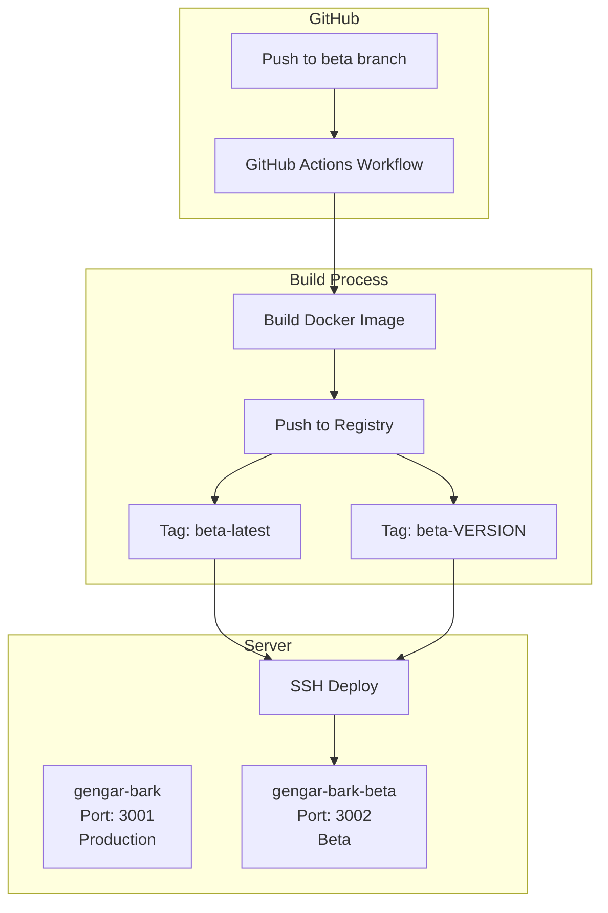

# Design Document: Beta Branch Deployment

## Overview

本设计实现 beta 分支的独立 Docker 容器部署功能。通过创建一个新的 GitHub Actions workflow 文件，当代码推送到 beta 分支时，自动构建 Docker 镜像并部署到独立的容器中，使用不同的端口（3002）与生产环境（3001）隔离。

## Architecture



## Components and Interfaces

### 1. GitHub Actions Workflow File

创建新的 workflow 文件 `.github/workflows/deploy-beta.yml`，结构与现有的 `deploy.yml` 类似，但针对 beta 分支进行配置。

```yaml
# 主要配置差异
on:
  push:
    branches: ['beta']  # 监听 beta 分支

env:
  IMAGE_NAME: docker-registry.baobo.me/gengar-bark
  CONTAINER_NAME: gengar-bark-beta
  HOST_PORT: 3002
```

### 2. 容器配置对比

| 配置项 | Production | Beta |
|--------|------------|------|
| 容器名称 | gengar-bark | gengar-bark-beta |
| 主机端口 | 3001 | 3002 |
| 镜像标签 | latest, {VERSION} | beta-latest, beta-{VERSION} |
| 环境变量 | ENV_PROD | ENV_PROD |
| 内存限制 | 1g | 1g |
| 内存预留 | 512m | 512m |

### 3. 部署脚本逻辑

```bash
# Beta 容器部署流程
1. 停止并删除现有 gengar-bark-beta 容器
2. 拉取新的 beta 镜像
3. 启动新容器，映射端口 3002:3000
4. 等待健康检查通过
5. 验证部署成功
6. 清理旧镜像
```

## Data Models

### Workflow 环境变量

```yaml
env:
  IMAGE_NAME: docker-registry.baobo.me/gengar-bark
  CONTAINER_NAME: gengar-bark-beta
  HOST_PORT: 3002
  NODE_VERSION: '18'
  DOCKER_BUILDKIT: 1
  COMPOSE_DOCKER_CLI_BUILD: 1
```

### Docker 容器标签

```yaml
labels:
  - deployment.version: beta-{VERSION}
  - deployment.timestamp: {ISO8601_TIMESTAMP}
  - deployment.branch: beta
```

## Correctness Properties

*A property is a characteristic or behavior that should hold true across all valid executions of a system-essentially, a formal statement about what the system should do. Properties serve as the bridge between human-readable specifications and machine-verifiable correctness guarantees.*

由于本功能主要涉及 CI/CD 配置文件（YAML），属于基础设施即代码（IaC），大部分验证需要通过实际部署来确认。以下是可以通过静态分析验证的属性：

### Property 1: 端口配置唯一性

*For any* deployment configuration, the beta container port (3002) SHALL be different from the production container port (3001).

**Validates: Requirements 3.1, 3.2**

### Property 2: 容器命名唯一性

*For any* deployment configuration, the beta container name (gengar-bark-beta) SHALL be different from the production container name (gengar-bark).

**Validates: Requirements 2.1**

### Property 3: 镜像标签格式一致性

*For any* beta deployment, the image tags SHALL follow the format "beta-latest" and "beta-{TIMESTAMP}-{SHA}" where TIMESTAMP is YYYYMMDDHHMM and SHA is a 7-character git short hash.

**Validates: Requirements 6.1, 6.2**

## Error Handling

### 部署失败场景

1. **Docker 构建失败**
   - 工作流将自动失败并输出构建日志
   - 不会影响现有运行的容器

2. **健康检查失败**
   - 最多重试 30 次，每次间隔 2 秒
   - 失败后输出容器最后 100 行日志
   - 工作流标记为失败

3. **SSH 连接失败**
   - GitHub Actions 将报告连接错误
   - 部署中止，不影响现有容器

4. **镜像拉取失败**
   - 部署脚本将失败
   - 现有容器继续运行

### 回滚策略

由于 beta 环境是测试环境，不需要自动回滚。如果部署失败：
1. 检查 GitHub Actions 日志
2. 修复问题后重新推送到 beta 分支
3. 如需手动回滚，可以 SSH 到服务器手动启动旧版本镜像

## Testing Strategy

### 配置验证测试

1. **YAML 语法验证**
   - 使用 YAML linter 验证 workflow 文件语法正确性

2. **端口配置测试**
   - 验证 beta 和 production workflow 使用不同端口

3. **容器名称测试**
   - 验证 beta 和 production workflow 使用不同容器名称

### 集成测试

1. **手动触发测试**
   - 创建 beta 分支并推送代码
   - 验证 GitHub Actions 工作流被触发
   - 验证 Docker 镜像构建成功
   - 验证容器部署成功
   - 验证健康检查端点响应

2. **并行运行测试**
   - 同时运行 production 和 beta 容器
   - 验证两个容器可以同时访问
   - 验证端口不冲突

### 测试框架

由于本功能主要是 CI/CD 配置，不涉及应用代码，测试主要通过：
- YAML 语法检查工具
- 实际部署验证
- 手动端到端测试
