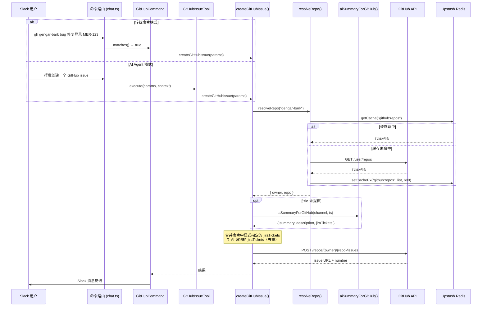
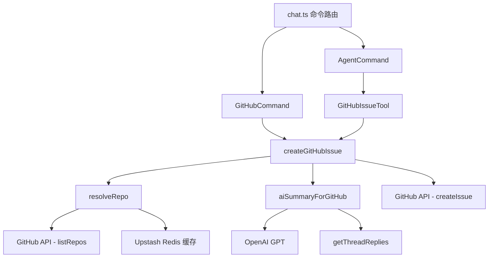

# Design Document: GitHub Issue Creation

## Overview

为 Gengar Bark Slack 机器人新增 GitHub Issue 创建功能。该功能复用现有的 Jira 创建架构模式，支持两种触发路径：

1. **传统命令模式**：用户输入 `gh <repo> [label] [title]` 或 `github <repo> [label] [title]`
2. **AI Agent 模式**：用户通过自然语言描述意图，由 Agent 调用工具创建 issue

核心数据流：Slack 消息 → 命令解析/Agent 识别 → 仓库名解析 → AI 摘要（可选）→ GitHub API 创建 → Slack 反馈。

设计遵循现有代码库的模式：Command 接口用于传统命令、Tool 接口用于 Agent 工具、axios + Bearer token 用于 GitHub API 调用、Upstash Redis 用于缓存。

## Architecture

### 数据流图



### 模块关系图




## Components and Interfaces

### 新增文件

| 文件路径 | 职责 |
|---------|------|
| `lib/github/create-issue.ts` | GitHub Issue 创建核心逻辑（createGitHubIssue、resolveRepo、aiSummaryForGitHub） |
| `lib/agent/tools/github-issue-tool.ts` | AI Agent 工具封装（GitHubIssueTool） |
| `.docs/github-issue.md` | GitHub Issue 创建功能的完整开发者文档 |

### 修改文件

| 文件路径 | 修改内容 |
|---------|---------|
| `lib/commands/gengar-commands.ts` | 新增 GitHubCommand 类 |
| `lib/events-handlers/chat.ts` | 在命令列表中注册 GitHubCommand（JiraCommand 之后） |
| `lib/agent/tools/index.ts` | 注册 GitHubIssueTool 到 createAllTools() 和 getAvailableToolNames() |

### 接口设计

#### 1. `lib/github/create-issue.ts` — 核心模块

```typescript
/** 推荐的 Angular commit 风格 label 列表（仅供参考，不作为严格校验） */
const SUGGESTED_LABELS = ['bug', 'feat', 'fix', 'ci', 'perf', 'docs', 'style', 'refactor', 'test', 'chore'] as const;

/** 仓库解析结果 */
interface ResolvedRepo {
  owner: string;
  repo: string;
}

/** GitHub Issue 创建参数 */
interface CreateGitHubIssueParams {
  repoName: string;
  label?: string;
  title?: string;
  description?: string;
  channel: string;
  threadTs: string;
  userName: string;
  jiraTickets?: string[];  // 关联的 Jira ticket 号，如 ["MER-123", "CRM-456"]
}

/** GitHub Issue 创建结果 */
interface GitHubIssueResult {
  success: boolean;
  issueUrl?: string;
  issueNumber?: number;
  error?: string;
}

/**
 * 解析仓库名为 owner/repo。
 * 使用 GITHUB_PAT 调用 GET /user/repos 获取可访问仓库列表，
 * 结果缓存到 Redis（key: "github:repos"，TTL: 600s）。
 * 精确匹配优先，否则模糊匹配（包含关系）。
 */
async function resolveRepo(repoName: string): Promise<ResolvedRepo>

/**
 * 从 Slack 线程生成 issue 的 title、description，并自动识别 Jira ticket 号。
 * 调用 GPT 模型，超时 6 秒后返回空值。
 * 复用 getThreadReplies() 和 getGPT()。
 * Prompt 要求 AI 同时提取 jiraTickets 字段（参考现有 generatePromptForJira 中 issueKey 的提取方式，
 * 格式为 XX-1234，如 MER-123、CRM-456）。
 */
async function aiSummaryForGitHub(channel: string, ts: string): Promise<{ summary: string; description: string; jiraTickets: string[] }>

/**
 * 判断命令中 repo 之后的 token 是否应被视为 label。
 * 启发式规则：单个单词（不含空格）视为 label。
 * 这意味着任何单词都可以作为 label，不限于推荐列表。
 */
function isLabelToken(tokens: string[], repoIndex: number): boolean

/**
 * 解析命令文本，提取 repo、label、title 和 jiraTickets。
 * 格式：gh/github <repo> [label] [title] [JIRA-123 ...]
 * 启发式规则：repo 之后的第一个参数如果是单个单词（不含空格），则视为 label；
 * 剩余部分视为 title。label 不限于推荐列表，任何单个单词都可作为 label。
 * 同时从整个命令文本中提取所有匹配 /[A-Z]+-\d+/g 格式的 Jira ticket 号。
 */
function parseGitHubCommand(text: string): { repo: string; label?: string; title?: string; jiraTickets?: string[] }

/**
 * 创建 GitHub Issue 的核心函数。
 * 1. resolveRepo() 解析仓库
 * 2. 如果 title 为空，调用 aiSummaryForGitHub()
 * 3. 合并 jiraTickets（命令中显式指定 + AI 从线程中识别，去重）
 * 4. 如果有 jiraTickets，在 title 末尾追加 ticket 号（空格间隔）
 * 5. 构建 issue body（reporter、thread link、description、jira tickets）
 * 6. POST /repos/{owner}/{repo}/issues
 * 7. 如果 label 有效，附加到 issue
 */
async function createGitHubIssue(params: CreateGitHubIssueParams): Promise<GitHubIssueResult>
```

#### 2. `lib/agent/tools/github-issue-tool.ts` — Agent 工具

```typescript
/**
 * GitHubIssueTool 实现 Tool 接口。
 * name: "create_github_issue"
 * 参数 schema: repo (required), label (optional, string), title (optional), description (optional), jiraTickets (optional, string[])
 * 调用 createGitHubIssue() 并返回 ToolResult。
 */
class GitHubIssueTool implements Tool {
  name = 'create_github_issue';
  description = 'Create a new GitHub issue in the specified repository. Use this when users want to create bug reports, feature requests, or track tasks on GitHub.';
  parameters: ToolParameterSchema;
  cacheable = false;

  async execute(params: Record<string, unknown>, context: AgentContext): Promise<ToolResult>;
}

function createGitHubIssueTool(): GitHubIssueTool;
```

#### 3. `lib/commands/gengar-commands.ts` — GitHubCommand

```typescript
/**
 * GitHubCommand 实现 Command 接口。
 * matches(): 匹配 /^(gh|github)\s+\S+/i
 * execute(): 调用 parseGitHubCommand() + createGitHubIssue()，
 *            成功/失败通过 postMessage() 反馈到 Slack 线程。
 */
class GitHubCommand implements Command {
  constructor(
    private channel: string,
    private ts: string,
    private userId: string,
  );

  matches(text: string): boolean;
  async execute(text: string): Promise<void>;
}
```


## Data Models

### GitHub API 请求/响应

#### 仓库列表 — `GET /user/repos`

请求头：
```
Authorization: Bearer ${GITHUB_PAT}
Accept: application/vnd.github.v3+json
User-Agent: GengarBark-Bot
```

查询参数：`per_page=100&sort=updated`

响应（简化）：
```typescript
interface GitHubRepo {
  full_name: string;  // "owner/repo"
  name: string;       // "repo"
  owner: { login: string };
}
```

缓存结构（Redis key: `github:repos`，TTL: 600s）：
```typescript
// 序列化为 JSON 字符串存储
type CachedRepoList = Array<{ owner: string; repo: string; fullName: string }>;
```

#### 创建 Issue — `POST /repos/{owner}/{repo}/issues`

请求体：
```typescript
interface CreateIssueRequest {
  title: string;
  body: string;
  labels?: string[];  // 如 ["bug"]
}
```

响应（简化）：
```typescript
interface CreateIssueResponse {
  number: number;
  html_url: string;  // "https://github.com/owner/repo/issues/123"
}
```

### AI 摘要 Prompt 结构

系统提示词要求 GPT 从 Slack 线程消息中提取（参考现有 `generatePromptForJira` 中 issueKey 的提取方式）：
```typescript
interface GitHubAISummary {
  summary: string;      // 用作 issue title
  description: string;  // 用作 issue body 的一部分
  jiraTickets: string[]; // 从线程中识别的 Jira ticket 号（格式 XX-1234），如 ["MER-123", "CRM-456"]
}
```

### Issue Body 模板

```
Reporter: {userName}
Slack Thread: {threadLink}

{AI generated description 或 用户提供的 description}

## Related Jira Tickets
- [MER-123](https://moego.atlassian.net/browse/MER-123)
- [CRM-456](https://moego.atlassian.net/browse/CRM-456)
```

注：Related Jira Tickets 区域仅在存在关联 ticket 时才附加到 body 中。Jira ticket 来源包括：用户在命令中显式指定的 ticket 号，以及 AI 从 Slack 线程中自动识别的 ticket 号。两个来源的结果会合并去重。

### 推荐 Label 列表

```typescript
const SUGGESTED_LABELS = ['bug', 'feat', 'fix', 'ci', 'perf', 'docs', 'style', 'refactor', 'test', 'chore'] as const;
```

此列表仅作为推荐参考，不作为严格校验。命令解析时，repo 之后的第一个单词（不含空格的 token）即被视为 label，无论是否在推荐列表中。如果 repo 之后只剩一个多词短语，则整体视为 title。

## Error Handling

### 错误分类与处理策略

| 错误场景 | 处理方式 | 用户反馈 |
|---------|---------|---------|
| `GITHUB_PAT` 未配置 | 在 `createGitHubIssue()` 入口检查，立即返回错误 | `❌ GitHub token 未配置，请设置 GITHUB_PAT 环境变量` |
| 仓库名无法匹配 | `resolveRepo()` 抛出错误，包含查询的仓库名 | `❌ 未找到匹配的仓库: {repoName}` |
| GitHub API 认证失败 (401) | 捕获 axios 错误，检查 status code | `❌ GitHub token 无效或已过期，请更新 GITHUB_PAT` |
| GitHub API 权限不足 (403) | 捕获 axios 错误，检查 status code | `❌ 没有权限在 {owner}/{repo} 创建 issue` |
| 仓库不存在 (404) | 捕获 axios 错误，检查 status code | `❌ 仓库 {owner}/{repo} 不存在或无权访问` |
| AI 摘要超时 (>6s) | Promise.race + setTimeout，超时返回空值 | 静默降级，使用空 title/description 继续创建 |
| AI 摘要解析失败 | try-catch JSON.parse，返回空值 | 静默降级，同上 |
| 命令格式错误（缺少 repo） | `parseGitHubCommand()` 返回 null | `❌ 命令格式错误，请使用: gh <repo> [label] [title]` |
| Redis 缓存读写失败 | try-catch，降级为直接调用 API | 静默降级，不影响主流程 |
| Jira ticket 格式不合法 | 正则不匹配则忽略，不影响 issue 创建 | 静默忽略，不报错 |

### 错误处理模式

遵循现有 Jira 创建的模式：
- 核心函数 `createGitHubIssue()` 返回 `GitHubIssueResult` 对象（包含 success 标志），不抛出异常
- `GitHubCommand.execute()` 根据 result.success 决定发送成功/失败消息
- `GitHubIssueTool.execute()` 将结果映射为 `ToolResult`
- 所有外部调用（GitHub API、AI、Redis）都有 try-catch 保护

## Testing Strategy

### 测试框架

- 使用 **vitest** 进行单元测试
- 运行命令：`npx vitest run`（非监听模式）

### 测试文件

| 测试文件 | 覆盖范围 |
|---------|---------|
| `lib/github/__tests__/create-issue.test.ts` | 命令解析、仓库匹配、Issue 创建核心逻辑 |
| `lib/agent/tools/__tests__/github-issue-tool.test.ts` | Agent 工具封装 |

### 单元测试用例

#### 命令匹配（matches）

- `gh gengar-bark` → true
- `github repo bug title` → true
- `GH Repo` → true（大小写不敏感）
- `jira MER Bug` → false
- `ghrepo` → false（缺少空格）

#### 命令解析（parseGitHubCommand）

- `gh gengar-bark bug 修复登录` → `{ repo: "gengar-bark", label: "bug", title: "修复登录" }`
- `gh gengar-bark hotfix 紧急修复` → `{ repo: "gengar-bark", label: "hotfix", title: "紧急修复" }`（自定义 label）
- `gh gengar-bark 修复登录问题` → `{ repo: "gengar-bark", title: "修复登录问题" }`（无 label，多词直接作为 title）
- `gh gengar-bark` → `{ repo: "gengar-bark" }`（仅 repo）
- `gh gengar-bark bug` → `{ repo: "gengar-bark", label: "bug" }`（仅 label 无 title）
- `gh gengar-bark bug 修复登录 MER-123` → `{ repo: "gengar-bark", label: "bug", title: "修复登录", jiraTickets: ["MER-123"] }`
- `gh gengar-bark bug 修复登录 MER-123 CRM-456` → `{ repo: "gengar-bark", label: "bug", title: "修复登录", jiraTickets: ["MER-123", "CRM-456"] }`
- `gh gengar-bark 修复 MER-123 的问题` → `{ repo: "gengar-bark", title: "修复 的问题", jiraTickets: ["MER-123"] }`（从 title 中提取 ticket 并移除）

#### 仓库解析（resolveRepo）

- 精确匹配：查询 `gengar-bark` 命中 `moego/gengar-bark`
- 模糊匹配：查询 `gengar` 命中 `moego/gengar-bark`
- 精确优先：列表中同时有 `gengar` 和 `gengar-bark`，查询 `gengar` 返回精确匹配
- 无匹配时抛出错误
- Redis 缓存命中时不调用 GitHub API
- Redis 缓存未命中时调用 API 并写入缓存

#### Issue 创建（createGitHubIssue）

- 成功创建返回 `{ success: true, issueUrl, issueNumber }`
- Issue body 包含 reporter、thread link、description
- 有 label 时 issue 创建请求包含 labels 字段
- 无 title 时调用 AI 摘要
- AI 摘要超时（>6s）时降级继续创建
- `GITHUB_PAT` 未配置时返回错误
- 有 jiraTickets 时 issue body 包含 Related Jira Tickets 区域，每个 ticket 为 Markdown 链接
- 无 jiraTickets 时 issue body 不包含 Related Jira Tickets 区域
- 命令中显式指定的 jiraTickets 与 AI 识别的 jiraTickets 合并去重
- Jira ticket 链接格式为 `[MER-123](https://moego.atlassian.net/browse/MER-123)`
- 有 jiraTickets 时 issue title 末尾追加 ticket 号（如 "修复登录 MER-123 CRM-456"）

#### Agent 工具（GitHubIssueTool）

- 成功时返回 `{ success: true, displayText, data: { issueUrl, issueNumber } }`
- 失败时返回 `{ success: false, error }`
- `createAllTools()` 包含 GitHubIssueTool
- 工具 name 为 `create_github_issue`
- 工具 parameters schema 包含 jiraTickets 可选参数（string[]）

### 测试配置要求

- 外部依赖（GitHub API、Slack API、OpenAI、Redis）在测试中使用 mock
- 每个测试用例应独立，不依赖执行顺序
