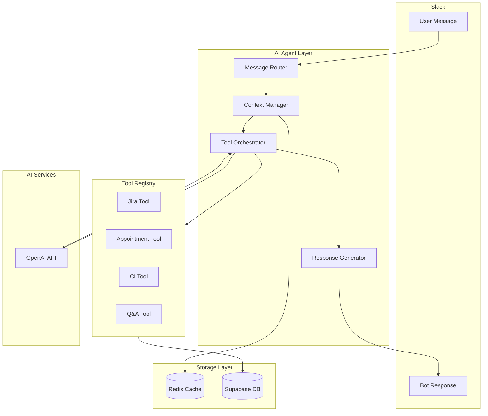

# Design Document: Slack Bot AI Agent

## Overview

This design describes an intelligent AI agent layer for the existing Gengar Slack bot. The agent uses OpenAI's function calling capabilities to understand natural language, maintain conversation context, and orchestrate multiple tools to fulfill user requests. The architecture follows a modular design with clear separation between intent understanding, tool execution, and response generation.

The agent builds on the existing command pattern but replaces rigid regex matching with LLM-based intent detection and tool selection. This allows users to interact naturally while the agent determines which tools to invoke and in what order.

## Architecture



## Components and Interfaces

### 1. AgentContext

Encapsulates all context needed for processing a user request.

```typescript
interface AgentContext {
  // Slack identifiers
  channel: string;
  threadTs: string;
  userId: string;
  userName?: string;
  
  // Conversation state
  conversationHistory: ConversationMessage[];
  
  // Request metadata
  requestId: string;
  timestamp: Date;
}

interface ConversationMessage {
  role: 'user' | 'assistant' | 'system';
  content: string;
  timestamp: Date;
  toolCalls?: ToolCall[];
  toolResults?: ToolResult[];
}
```

### 2. Tool Interface

All tools implement this interface for registration and execution.

```typescript
interface Tool {
  name: string;
  description: string;
  parameters: ToolParameterSchema;
  execute(params: Record<string, unknown>, context: AgentContext): Promise<ToolResult>;
}

interface ToolParameterSchema {
  type: 'object';
  properties: Record<string, ParameterDefinition>;
  required: string[];
}

interface ParameterDefinition {
  type: 'string' | 'number' | 'boolean' | 'array' | 'object';
  description: string;
  enum?: string[];
}

interface ToolResult {
  success: boolean;
  data?: unknown;
  error?: string;
  displayText?: string;
}

interface ToolCall {
  toolName: string;
  parameters: Record<string, unknown>;
}
```

### 3. ToolRegistry

Manages tool registration and lookup.

```typescript
interface ToolRegistry {
  register(tool: Tool): void;
  get(name: string): Tool | undefined;
  getAll(): Tool[];
  getToolDefinitions(): OpenAIToolDefinition[];
}
```

### 4. ContextManager

Handles conversation context retrieval and storage.

```typescript
interface ContextManager {
  getContext(channel: string, threadTs: string): Promise<ConversationMessage[]>;
  saveMessage(channel: string, threadTs: string, message: ConversationMessage): Promise<void>;
  summarizeIfNeeded(messages: ConversationMessage[]): Promise<ConversationMessage[]>;
  resolveReference(reference: string, context: ConversationMessage[]): Promise<string | null>;
}
```

### 5. Orchestrator

Core agent logic that coordinates intent detection and tool execution.

```typescript
interface Orchestrator {
  process(userMessage: string, context: AgentContext): Promise<AgentResponse>;
}

interface AgentResponse {
  text: string;
  blocks?: SlackBlock[];
  toolsUsed: string[];
  success: boolean;
}
```

### 6. RateLimiter

Handles rate limiting and duplicate detection.

```typescript
interface RateLimiter {
  checkDuplicate(key: string): Promise<boolean>;
  checkUserLimit(userId: string): Promise<boolean>;
  recordRequest(userId: string): Promise<void>;
}
```

## Data Models

### Conversation Cache (Redis)

```typescript
// Key: `agent:context:{channel}:{threadTs}`
// TTL: 24 hours
interface CachedConversation {
  messages: ConversationMessage[];
  lastUpdated: number;
  summary?: string;  // Summarized older messages
}
```

### Tool Execution Log (Supabase)

```sql
CREATE TABLE agent_tool_executions (
  id UUID PRIMARY KEY DEFAULT gen_random_uuid(),
  request_id VARCHAR(255) NOT NULL,
  channel VARCHAR(255) NOT NULL,
  thread_ts VARCHAR(255) NOT NULL,
  user_id VARCHAR(255) NOT NULL,
  tool_name VARCHAR(100) NOT NULL,
  parameters JSONB,
  result JSONB,
  success BOOLEAN NOT NULL,
  execution_time_ms INTEGER,
  created_at TIMESTAMP WITH TIME ZONE DEFAULT NOW()
);

CREATE INDEX idx_tool_executions_channel_thread ON agent_tool_executions(channel, thread_ts);
CREATE INDEX idx_tool_executions_user ON agent_tool_executions(user_id);
```

### Rate Limit Tracking (Redis)

```typescript
// Key: `agent:ratelimit:{userId}`
// TTL: 60 seconds
// Value: request count (integer)

// Key: `agent:duplicate:{hash}`
// TTL: 120 seconds
// Value: "1"
```


## Correctness Properties

*A property is a characteristic or behavior that should hold true across all valid executions of a system—essentially, a formal statement about what the system should do. Properties serve as the bridge between human-readable specifications and machine-verifiable correctness guarantees.*

### Property 1: Intent Extraction Returns Valid Structure

*For any* user message string, when passed to the intent extraction function, the result SHALL be either a valid Intent object with required fields (type, confidence) or a null/unknown indicator—never an exception or malformed object.

**Validates: Requirements 1.1**

### Property 2: Fallback Response for Unknown Intent

*For any* user message that results in null/unknown intent, the agent response SHALL contain help text that includes at least one available capability description.

**Validates: Requirements 1.4**

### Property 3: Context Storage Round-Trip

*For any* valid ConversationMessage, storing it via saveMessage() and then retrieving via getContext() for the same channel/threadTs SHALL return a collection containing an equivalent message.

**Validates: Requirements 2.1**

### Property 4: Context Incorporated in LLM Calls

*For any* request processed by the orchestrator where conversation history exists, the messages array sent to the OpenAI API SHALL include the previous conversation messages in chronological order.

**Validates: Requirements 2.2**

### Property 5: Context Summarization Bounds

*For any* conversation with more than 20 messages, the output of summarizeIfNeeded() SHALL have length less than or equal to 20, and the total token count SHALL be within the configured limit.

**Validates: Requirements 2.3**

### Property 6: Tool Failure Error Reporting

*For any* tool execution that throws an error or returns success=false, the agent response SHALL contain error information and SHALL NOT expose raw stack traces or internal error details.

**Validates: Requirements 3.3**

### Property 7: Structured Data Uses Blocks

*For any* tool result containing structured data (appointments, orders, Jira tickets), the agent response SHALL include Slack blocks array with at least one block element.

**Validates: Requirements 4.2**

### Property 8: Error Responses Are User-Friendly

*For any* error condition during request processing, the response text SHALL be non-empty, SHALL NOT contain raw exception messages, and SHALL contain actionable guidance.

**Validates: Requirements 4.3**

### Property 9: Response Length Limit

*For any* agent response where detailed output was not explicitly requested, the text content length SHALL be less than or equal to 2000 characters.

**Validates: Requirements 4.4**

### Property 10: Duplicate Message Detection

*For any* message with identical (userId, channel, threadTs, text) sent twice within 120 seconds, the second invocation of checkDuplicate() SHALL return true, indicating the message should be ignored.

**Validates: Requirements 5.1**

### Property 11: Rate Limit Retry with Backoff

*For any* OpenAI API call that fails with a rate limit error, the retry mechanism SHALL wait at least 2^(attemptNumber) seconds before the next attempt, up to a maximum of 3 retries.

**Validates: Requirements 5.2**

### Property 12: Tool Result Caching

*For any* tool execution with cacheable results, calling the same tool with identical parameters within the cache TTL SHALL return the cached result without re-executing the tool.

**Validates: Requirements 5.3**

### Property 13: User Abuse Throttling

*For any* user who has made more than 10 requests within the last 60 seconds, checkUserLimit() SHALL return false, indicating the request should be throttled.

**Validates: Requirements 5.4**

### Property 14: Tool Registration Completeness

*For any* Tool registered via register(), the tool SHALL be retrievable via get(name), SHALL appear in getAll(), and SHALL be included in getToolDefinitions() with name, description, and parameters.

**Validates: Requirements 6.1, 6.2**

### Property 15: Tool Parameter Validation

*For any* tool invocation where the provided parameters do not match the registered schema (missing required fields, wrong types), the orchestrator SHALL reject the call before execution and return a validation error.

**Validates: Requirements 6.3**

### Property 16: Tool Context Contains Required Fields

*For any* tool execution, the AgentContext passed to the tool's execute() method SHALL contain non-null values for: channel, threadTs, userId, and requestId.

**Validates: Requirements 6.4**

## Error Handling

### Error Categories

1. **Validation Errors**: Invalid parameters, malformed requests
   - Return 400-level response with clear error message
   - Do not retry

2. **External Service Errors**: OpenAI API failures, Jira API failures
   - Retry with exponential backoff (max 3 attempts)
   - Log error details for debugging
   - Return user-friendly message on final failure

3. **Rate Limit Errors**: OpenAI rate limits, user abuse detection
   - Queue and retry for API rate limits
   - Return throttle message for user abuse

4. **Internal Errors**: Unexpected exceptions
   - Log full stack trace
   - Return generic error message to user
   - Alert on repeated occurrences

### Error Response Format

```typescript
interface ErrorResponse {
  success: false;
  error: {
    code: string;        // e.g., 'TOOL_EXECUTION_FAILED'
    message: string;     // User-friendly message
    suggestion?: string; // What the user can try instead
  };
}
```

### Retry Strategy

```typescript
const RETRY_CONFIG = {
  maxAttempts: 3,
  baseDelayMs: 1000,
  maxDelayMs: 10000,
  backoffMultiplier: 2,
};

async function withRetry<T>(
  operation: () => Promise<T>,
  isRetryable: (error: Error) => boolean
): Promise<T> {
  let lastError: Error;
  for (let attempt = 0; attempt < RETRY_CONFIG.maxAttempts; attempt++) {
    try {
      return await operation();
    } catch (error) {
      lastError = error as Error;
      if (!isRetryable(lastError) || attempt === RETRY_CONFIG.maxAttempts - 1) {
        throw lastError;
      }
      const delay = Math.min(
        RETRY_CONFIG.baseDelayMs * Math.pow(RETRY_CONFIG.backoffMultiplier, attempt),
        RETRY_CONFIG.maxDelayMs
      );
      await sleep(delay);
    }
  }
  throw lastError!;
}
```

## Testing Strategy

### Unit Tests

Unit tests verify specific examples and edge cases:

1. **Tool Registry Tests**
   - Register a tool and verify retrieval
   - Verify getToolDefinitions() format matches OpenAI schema
   - Test duplicate registration handling

2. **Context Manager Tests**
   - Save and retrieve conversation messages
   - Test summarization with exactly 21 messages
   - Test empty conversation handling

3. **Rate Limiter Tests**
   - Test duplicate detection within 2-minute window
   - Test user limit at exactly 10 requests
   - Test limit reset after 60 seconds

4. **Response Generator Tests**
   - Test Slack block formatting for appointments
   - Test error message formatting
   - Test response truncation at 2000 characters

### Property-Based Tests

Property-based tests verify universal properties across many generated inputs. Each property test will run a minimum of 100 iterations.

**Testing Framework**: fast-check (TypeScript property-based testing library)

**Property Test Implementation**:

1. **Property 3: Context Storage Round-Trip**
   - Generate random ConversationMessage objects
   - Store and retrieve, verify equivalence
   - Tag: **Feature: slack-bot-ai-agent, Property 3: Context storage round-trip**

2. **Property 5: Context Summarization Bounds**
   - Generate conversations with 21-100 messages
   - Verify output length ≤ 20
   - Tag: **Feature: slack-bot-ai-agent, Property 5: Context summarization bounds**

3. **Property 9: Response Length Limit**
   - Generate various response scenarios
   - Verify all responses ≤ 2000 characters
   - Tag: **Feature: slack-bot-ai-agent, Property 9: Response length limit**

4. **Property 10: Duplicate Message Detection**
   - Generate random message identifiers
   - Verify second call within window returns true
   - Tag: **Feature: slack-bot-ai-agent, Property 10: Duplicate message detection**

5. **Property 13: User Abuse Throttling**
   - Generate user IDs and request counts
   - Verify throttling activates at >10 requests
   - Tag: **Feature: slack-bot-ai-agent, Property 13: User abuse throttling**

6. **Property 14: Tool Registration Completeness**
   - Generate random Tool objects with valid schemas
   - Register and verify all retrieval methods work
   - Tag: **Feature: slack-bot-ai-agent, Property 14: Tool registration completeness**

7. **Property 15: Tool Parameter Validation**
   - Generate tools with schemas and invalid parameter sets
   - Verify validation rejects invalid parameters
   - Tag: **Feature: slack-bot-ai-agent, Property 15: Tool parameter validation**

8. **Property 16: Tool Context Contains Required Fields**
   - Generate AgentContext objects
   - Verify all required fields are present and non-null
   - Tag: **Feature: slack-bot-ai-agent, Property 16: Tool context contains required fields**

### Integration Tests

1. **End-to-End Flow**: User message → Intent → Tool execution → Response
2. **Multi-Tool Orchestration**: Request requiring multiple tool calls
3. **Error Recovery**: Tool failure with graceful degradation
